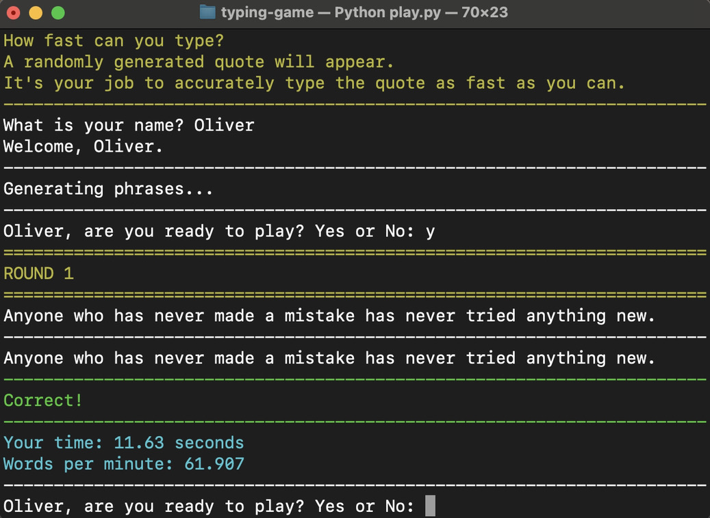
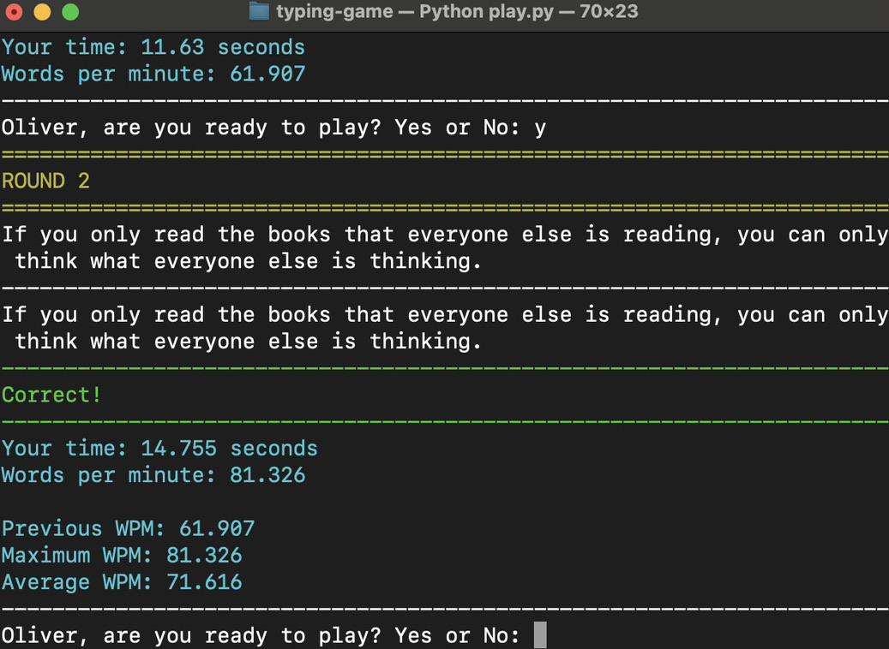
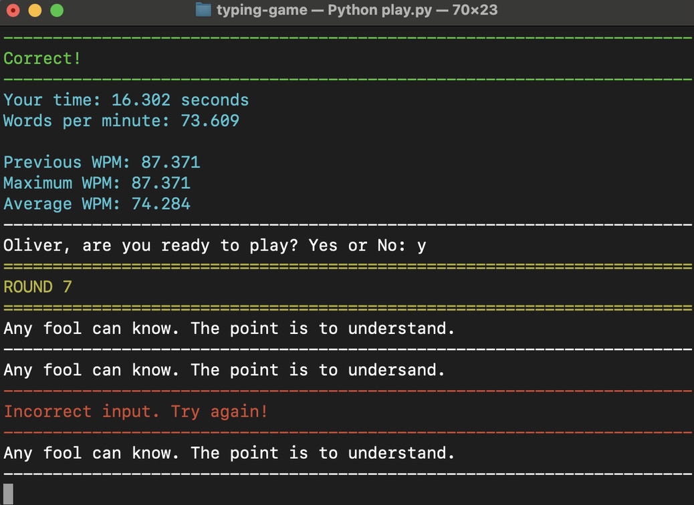
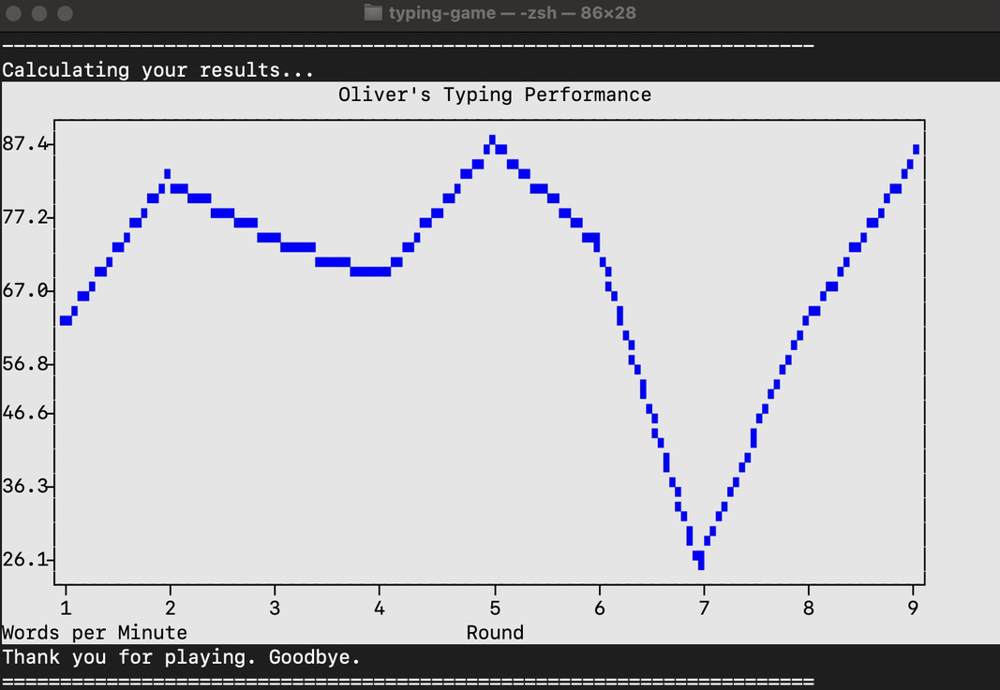

<h1 align="center">Speed Typing Game</h1>

## Overview
This is a simple text-based typing game created with Python 3 that is playable in your terminal. This game is my first fully independent coding project--no tutorials whatsoever! 
 

The goal of the game is to quickly and accurately type the randomly generated phrase. The program keeps track of your time and scores, and gives you instantateous feedback of your words per minute (wpm).
  

*Here is the beginning sequence of the typing game in the terminal.*
  

  

*This is after the second round with latest, maximum, and average WPM*
  

  

*When you enter an incorrect answer, the timer will not stop and the game will keep prompting you until you enter the correct answer.*
  

  

*After you end the game, each round's WPM is graphed and displayed*
  

  

## Features
* Web scraping using BeautifulSoup and lxml modules
* Random phrase generation using the random module
* Text-based interface and interaction
* Input validation
* Function recursion
* For- and while-loops, if/elif/else statements
* Arithmetic calculations
* Plotext in-terminal graphing
  

## Technologies and Libraries
* Python 3.10.0
* bs4, lxml, numpy, random, requests, sys, time, plotext
  

## Check out some of my other projects!
* JavaScript Calculator
  * [Live Page](https://olkone.github.io/calculator/)
  * [Repository](https://github.com/olkone/calculator)
* Sketch!
  * [Live Page](https://olkone.github.io/sketch/)
  * [Repository](https://github.com/olkone/sketch)
* Rock, Paper, Scissors
  * [Live Page](https://olkone.github.io/rock-paper-scissors/)
  * [Repository](https://github.com/olkone/rock-paper-scissors/)
* Writing Portfolio Webpage
  * [Live Page](https://olkone.github.io/writing-portfolio/)
  * [Repository](https://github.com/olkone/writing-portfolio)
